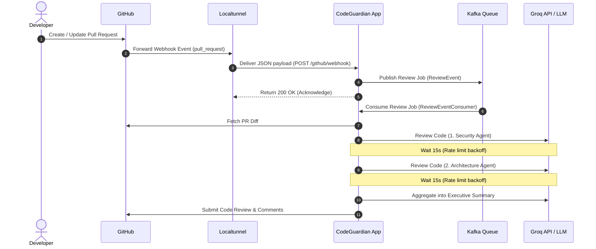

# 🛡️ CodeGuardian AI — Automated Pull Request Reviewer

CodeGuardian AI is an intelligent, multi-agent automated code review system. It listens to GitHub pull request webhooks in real-time, processes the changes through specialized AI agents (Security and Architecture), and posts aggregated code reviews directly back to the pull request.

---

## 🏗️ Project Architecture & Stack

The system follows a clean, Hexagonal (Ports & Adapters) architectural pattern to isolate business logic from databases and external APIs:

```
                  ┌──────────────────────────────────────────────┐
                  │                  PORT & ADAPTERS             │
                  │                                              │
                  │  ┌──────────────┐       ┌──────────────┐     │
                  │  │  Inbound     │       │  Outbound    │     │
                  │  │  Adapters    │       │  Adapters    │     │
                  │  └──────┬───────┘       └──────▲───────┘     │
                  │         │                      │             │
                  │  ┌──────▼──────────────────────┴───────┐     │
                  │  │          Core Usecases              │     │
                  │  │  (Orchestrator, Multi-Agent Review) │     │
                  │  └──────────────┬──────────────────────┘     │
                  │                 │                            │
                  │          ┌──────▼──────┐                     │
                  │          │ Core Domain │                     │
                  │          └─────────────┘                     │
                  └──────────────────────────────────────────────┘
```

* **Core Domain:** Represents entities like `PullRequest`, `ReviewResult`, `AgentReport`, and `Comment`.
* **Use Cases:** Orchestrates the review flow, processes diffs, executes sequential multi-agent evaluations, and handles token/rate limit backoffs.
* **Inbound Adapters:** REST webhook controller (`GitHubWebhookController`) and REST APIs for feedback, indexing, and chat.
* **Outbound Adapters:** GitHub Client wrapper (`GitHubClientAdapter`), Qdrant Vector store adapter, and PostgreSQL persistence.

### Technical Stack
* **Backend:** Spring Boot (Java 17 / Maven)
* **Frontend:** React (Dashboard UI on port `3000`)
* **Message Broker:** Apache Kafka & Zookeeper (Ensures asynchronous, reliable processing of reviews)
* **Relational Storage:** PostgreSQL (Persists PR state, review logs, and audit logs)
* **Vector Store:** Qdrant (Indices codebase embeddings for semantic search/RAG)
* **Cache Store:** Redis
* **AI Engine:** Groq API (`llama-3.1-8b-instant` or Gemini API)

---

## 🔄 Workflow Pipeline

The end-to-end review lifecycle works as follows:



### Self-Review and Format Fallbacks
To handle GitHub API constraints, the system implements a multi-tier fallback mechanism:
1. **Initial Submission:** Attempts a structured inline review with specific line comments.
2. **Path Unresolved Fallback (422):** If the generated code references lines/files that GitHub cannot map in the current diff, the adapter catches the exception, collapses all comments into the markdown summary body, and retries.
3. **Self-Review Fallback (422):** If the repository owner created the PR, GitHub blocks automated reviews (`APPROVE` / `REQUEST_CHANGES`). The system catches this constraint and submits the report as a simple `COMMENT` review.

---

## 🚀 How to Run Locally

### 1. Prerequisites
Ensure you have the following installed:
* [Docker & Docker Compose](https://www.docker.com/)
* PowerShell (if using the test scripts on Windows)

### 2. Configure Environment Variables
Create a `.env` file in the root directory (based on `.env` template) containing:
```properties
# Relational DB
POSTGRES_DB=codeguardian
POSTGRES_USER=postgres
POSTGRES_PASSWORD=postgres

# External API Tokens
GITHUB_TOKEN=your_github_personal_access_token
GROQ_API_KEY=your_groq_api_key
GROQ_MODEL=llama-3.1-8b-instant

# App Defaults
QDRANT_COLLECTION_NAME=codeguardian-codebase
```

### 3. Spin Up Services
Build the application and start the entire stack:
```bash
docker compose up --build -d
```
Verify all services are healthy:
```bash
docker compose ps
```
The services will be exposed at:
* **Spring Boot API:** `http://localhost:8080`
* **React Dashboard UI:** `http://localhost:3000`

---

## 🔗 Connecting to a GitHub Repo (Real-Time Webhooks)

To let GitHub send events to your locally running container, you must expose port `8080` via a public URL.

### Step 1: Run the Tunnel
Start `localtunnel` pointing to your local port, forcing IPv4 binding (`127.0.0.1`):
```bash
lt --port 8080 --subdomain ai-pr-reviewer --local-host 127.0.0.1
```
This will print your public endpoint:
`your url is: https://ai-pr-reviewer.loca.lt`

### Step 2: Register Webhook in GitHub Settings
1. Go to your GitHub repository -> **Settings** -> **Webhooks** -> **Add webhook**.
2. Set the **Payload URL** to:
   ```
   https://ai-pr-reviewer.loca.lt/github/webhook
   ```
3. Set the **Content type** to `application/json`.
4. Select **Let me select individual events** -> check **Pull requests**.
5. Save the webhook. GitHub will send a test ping, which should receive a `200 OK` response.

---

## 🧪 Ad-hoc Testing & Verification

If you want to manually test a review without pushing commits, run the PowerShell helper script [trigger_review.ps1](trigger_review.ps1):
```powershell
# Run ad-hoc review locally:
powershell -ExecutionPolicy Bypass -File ./trigger_review.ps1 -PrUrl "https://github.com/owner/repository/pull/number"

# Run ad-hoc review via the public tunnel:
powershell -ExecutionPolicy Bypass -File ./trigger_review.ps1 -PrUrl "https://github.com/owner/repository/pull/number" -WebhookUrl "https://ai-pr-reviewer.loca.lt/github/webhook"
```

---

## 📋 Commands Reference

| Action | Command |
|---|---|
| **Start Stack (Build)** | `docker compose up --build -d` |
| **Stop Stack** | `docker compose down` |
| **Check App Logs** | `docker logs -f codeguardian-app` |
| **Check Container Status** | `docker compose ps` |
| **Expose Tunnel** | `lt --port 8080 --subdomain ai-pr-reviewer --local-host 127.0.0.1` |
| **Ad-Hoc Test Script** | `powershell -ExecutionPolicy Bypass -File ./trigger_review.ps1 -PrUrl "<PR_URL>"` |
